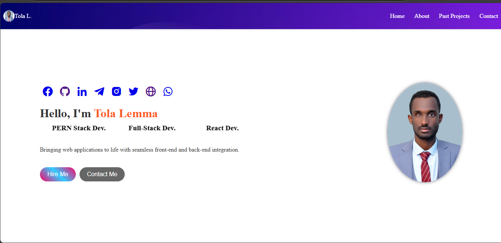
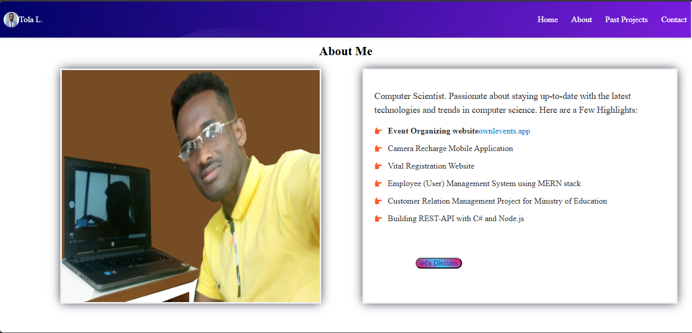
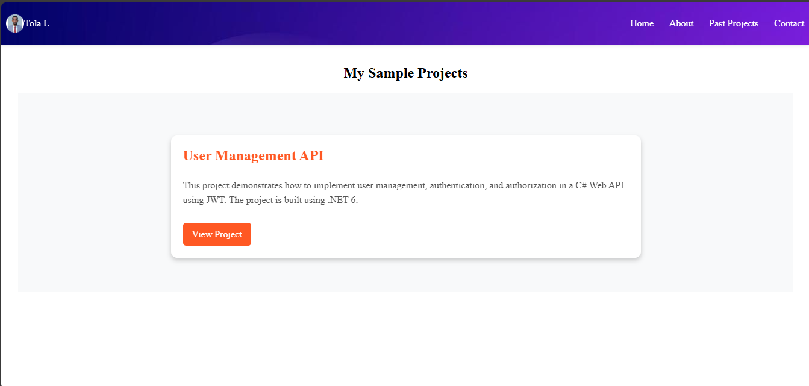
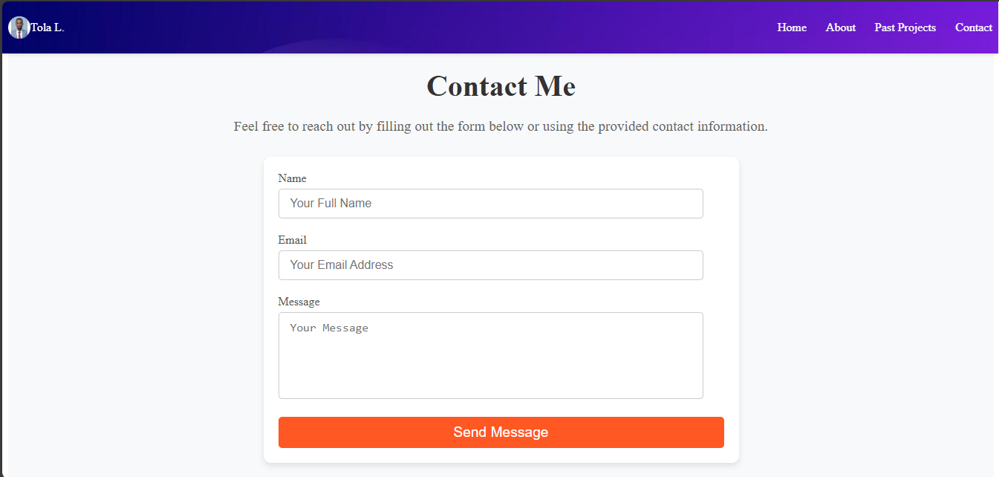
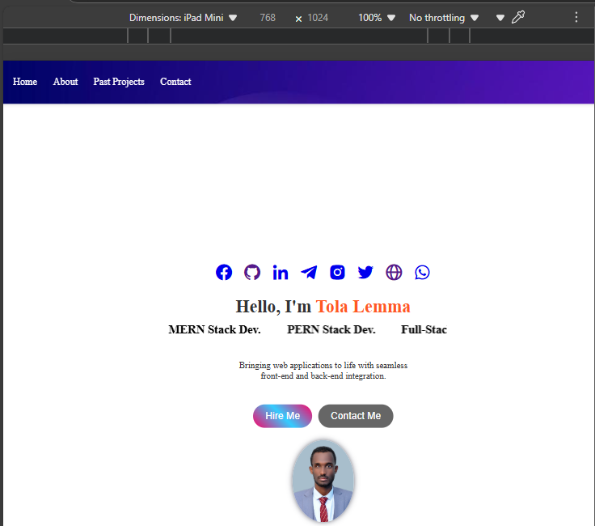
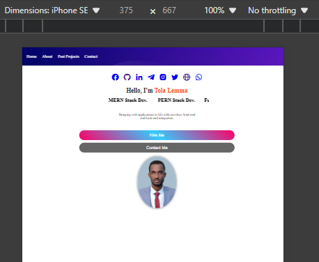

# HTML & CSS ONLY Portfolio project
A responsive personal portfolio website showcasing my projects, skills, and contact information.

## Features

- **Home Section**: Introduction and social media links.
- **About Section**: Overview of professional background and expertise.
- **Projects Section**: Interactive slideshow with project details and links.
- **Contact Section**: Form for visitors to get in touch.

## Tech Stack

- **HTML5**
- **CSS3**

## Screenshots

### Home Page


### About Page


### Projects Page


### Contact Page

## On Different Device(Responsiveness)
### On iPad


### On iPhone



## Live Demo

[Visit My Portfolio](https://portifolio-intertechub.onrender.com)

## Installation

1. Clone the repository:
   ```bash
   git clone https://github.com/Tola-lemma/HTML_CSS_ONLY_Portfolio_project.git

